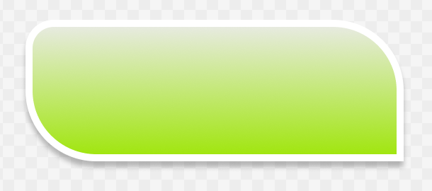
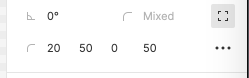
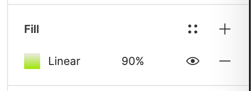
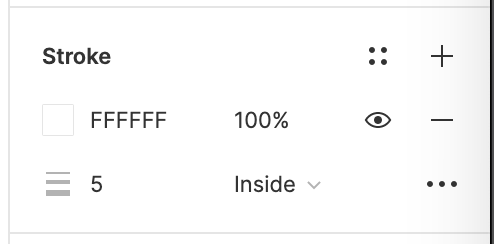
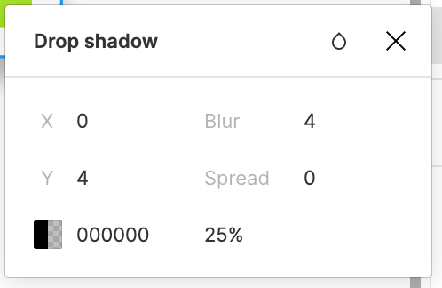
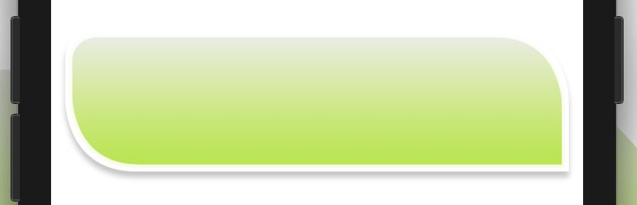
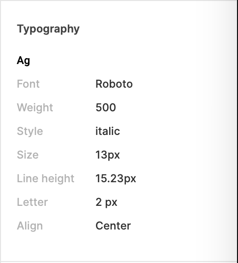
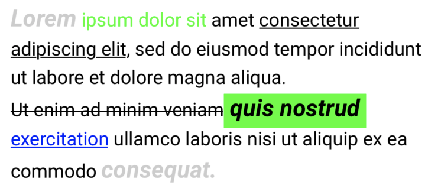

# FigmaKit

A library to make ui code synchronize with designer's works

## Features

- [x] Colors, corners, shadow, strokes, fill
- [x] Label attributed
- [ ] SwiftUI

### Colors and Fill

From designing



to source code
```swift
topView
    .corner(.mixed(20, 50, 0, 50))
    .fill(.linear(colors: [(0xEBEBEB, 0), (0x9EE505, 1)], alpha: 90))
    .stroke(.inside(0xFFFFFF, size: 5))
    .shadow(.drop(0x000000, x: 0, y: 4, b: 4, s: 0, alpha: 25))
```


#### Multiple corners' radius



```swift
view
    .corner(.mixed(20, 50, 0, 50))
```

#### Background



```swift
view
    .fill(.linear(colors: [(0xEBEBEB, 0), (0x9EE505, 1)], alpha: 90))
```
from gradients to solid color
```swift
view
    .fill(.solid(0xEBEBEB))
```

#### Strokes



```swift
view
    .stroke(.inside("#FFFFFF", size: 5))
```


#### Shadows



```swift
topView
    .shadow(.drop(0x000000, x: 0, y: 4, b: 4, s: 0, alpha: 25))
```

Tada! Real-life result with **pixel perfection**




### Styles

#### Typography
Never missmatch designing text styling



as 
```swift
let typo = Typography.custom(
    "Roboto",
    weight: 500,
    style: .italic,
    size: 13,
    lineHeight: 15.23,
    letter: 2)

codeLabel
    .typography(typo)
    .alignment(.center)
```

#### Rich Text
Or with multiple and complex styles in one place



```swift
let normal = Typography.custom("Roboto", weight: 400, size: 16, lineHeight: 21, letter: 1)
let bold = Typography.custom("Roboto", weight: 700, size: 20, style: .italic)

let foreground = 0x000000
let green = 0x00FF00
let grey = 0xCCCCCC

sampleLabel
    
    // Mark default style
    .setDefault(normal, color: foreground)
    
    .add("Lorem", typography: bold, color: grey)
    .add(" ipsum dolor sit", typography: normal, color: green)
    .add(" amet ")
    .add("consectetur adipiscing elit", style: .underlined)
    .add(", sed do eiusmod tempor incididunt ut labore et dolore magna aliqua. \n")
    .add("Ut enim ad minim veniam", style: .strikeThrough)
    .add(" quis nostrud ", typography: bold, color: foreground, background: green)
    .add("exercitation", style: .link("https://google.com"))
    .add(" ullamco laboris nisi ut aliquip ex ea commodo ")
    .add("consequat.", typography: bold, color: grey)
    
    // Label-wide applying should be done finally
    .alignment(.left)
    
    // Don't forget to clean for next use
    .cleanUp()
```

## Requirement

iOS 11.0+
Swift 4.0+

## Installation

### Swift Package manager

- Click `File` → `Swift Packages` → `Add Package Dependency`
- Enter `https://github.com/haphanquang/FigmaKit`

## Support

Ask me anything at https://hapq.me/contact

## License

FigmaKit is released under the Unlicense. See LICENSE for details.
